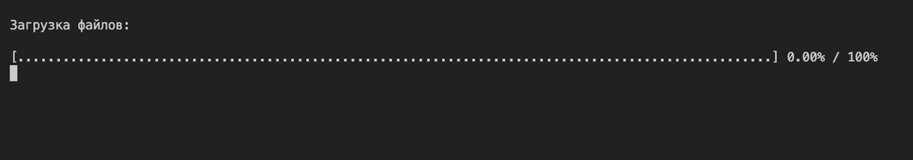

# Имитация загрузки файлов



В этом задании тебе предстоит сделать имитацию загрузки файлов в виде прогрессбара в терминале. В папке `files` лежат несколько файлов. Программа должна сымитировать загрузку каждого из этих файлов, и загрузка файла должна занять время пропорциональное его размеру. Скажем загрузка файла `small.txt` (≈ 500 байт) будет занимать 1 секунду, тогда загрузка файла `big.txt` (≈ 5000 байт) должна занимать 10 секунд (удобные тайминги подбери сам).

Во время загрузки файлов в терминал должен выводиться прогрессбар (смотри анимацию выше). Каждый раз после загрузки очередного файла прогрессбар должен заполняться на процент от общего размера всех файлов. Это значит, что если общий размер файлов примерно 8000 байт, то после загрузки файла  `small.txt` (≈ 500 байт) прогрессбар должен заполниться примерно на 6 процентов (500 байт от 8000 байт - это примерно 6 процентов).

Не обращай внимания, что текст этого задания выглядит громоздко. Постепенно делай релиз за релизом и у тебя всё получится!

## Release 1. Простой синхронный вариант (файл progressbarSync.js)

Теперь реализуй имитацию загрузки трёх файлов из папки `files`. Названия файлов в этом релизе можешь просто захардкодить. Используй синхронные функции:
- `fs.statSync(path)` - для того, чтобы узнать размер файла.
- `fs.readFileSync(path, encoding)` - чтобы прочитать файл. Так как это только имитация загрузки, то делать ничего с прочитанным контентом не нужно.
- `waitSync(sec)` - чтобы сымитировать время загрузки файла. Это синхронный аналог функции `setTimeout`, который тебе нужно будет взять из пакета https://www.npmjs.com/package/wait-sync.

Этот релиз можно делать вообще без циклов. Главное - отобразить прогрессбар для трёх файлов в папке `files`. Причешешь свой код и сделаешь его универсальным ты в следующих релизах.

## Release 2. Простой асинхронный вариант с параллельной загрузкой (файл progressbarParallel.js)

Теперь реализуй имитацию параллельной загрузки трёх файлов из папки `files`. Используй ТОЛЬКО асинхронные функции:
- `fs.stat(path)` - для того, чтобы узнать размер файла.
- `fs.readFile(path, encoding)` - чтобы прочитать файл.
- `setTimeout(callback, ms)` - чтобы сымитировать время загрузки файла.

Этот релиз можно делать вообще без циклов. Главное - отобразить прогрессбар для трёх файлов в папке `files`. Причешешь свой код и сделаешь его универсальным ты в следующих релизах.

А теперь сравни время работы твоих программ в случае синхронной и асинхронной загрузки файлов.

## Pre Release 3. Подготовка файлов

На этом этапе тебе необходимо создать минимум 10 файлов (чем больше - тем интереснее) в папке `files`. Наполни эти файлы разным количеством информации. Кстати, файлами могут быть даже картинки. Помни, количество информации в каждом файле должно быть разным, чтобы у тебя получились файлы разного размера. Файлы необязательно должны быть одинакового расширения.

**ВАЖНО!** Размеры твоих файлов должны быть разными, но сопоставимыми. Ведь если файл в 1 кб будет загружаться 1 секунду, то файлу в 2 гигабайта на это понадобится 12 суток!

## Release 3. Универсальный синхронный вариант (файл progressbarSync.js)

Теперь тебе пора сделать синхронную загрузку файлов универсальной. Это значит, что твой прогрессбар должен работать правильно для любых файлов в папке `files`. Чтобы узнать содержимое папки `files`, используй метод `fs.readdirSync(path)`.

## Release 4. Универсальный асинхронный вариант с параллельной загрузкой (progressbarParallel.js)

А теперь сделай асинхронную загрузку файлов так же универсальной.  Чтобы узнать содержимое папки `files`, используй метод `fs.readdir(path)`.

Чтобы дождаться завершения нескольких асинхронных функций, возвращающих промисы и вызванных параллельно, используй метод `Promise.all`.

<!-- 
Вот пример того как можно вызывать несколько асинхронных функций параллельно и дождаться пока все они завершат работу:

```js
// Некая асинхронная функция, принимающая callback
function asyncFunction(flag, callback) {
  setTimeout(() => {
    callback(flag * 2);
  }, 100);
}

const flags = [1, 2, 3, 4, 5];
// в этот массив асинхронно должны попасть все числа из массива flags умноженные на два
const results = [];

const totalCallbacksCount = flags.length;
let callbacksCalledCount = 0;

// вызываем асинхронную функцию для каждого флага
for (const flag of flags) {
  asyncFunction(flag, (result) => {
    // когда асинхронная функция закончила свою работу увеличиваем соответствующий счётчик на 1
    callbacksCalledCount++;
    results.push(result);
    // это условие значит, что все асинхронные функции завершили свою работу
    if (callbacksCalledCount === totalCallbacksCount) {
      doSomethingWithFlags(results);
    }
  });
}

function doSomethingWithFlags(results) {
  console.info('Results from all callbacks synchronized:', results);
}
```
-->

Оцени насколько твоя программа начала работать быстрее чем синхронный вариант.

## Release 5. *Опционально:* Зачем же асинхронно?

Возможно, ты сделал задание, но так и не понял зачем нужны были асинхронные методы. В таком случае давай сделаем приложение более реалистичным. При запуске программы будет открываться интерактивная консоль. Если ты нажмёшь на любую кнопку на клавиатуре, то консоль напишет тебе: `You pressed the "x" key`. Своего рода минимальное взаимодействие приложения с пользователем. А теперь запусти свою загрузку файлов. Если твоя реализация асинхронна, то ты, может быть, даже не почувствуешь, что программа что-то пытается загрузить. А вот если ты используешь синхронные методы... Тогда ты будешь очень недоволен, что программа так долго не реагирует на твои интенсивные нажатия на кнопки.

## Release 6. *Опционально:* Асинхронный вариант с последовательной загрузкой (progressbarSequence.js)

Теперь тебе нужно немного переделать твой асинхронный вариант с параллельной загрузкой так, чтобы файлы загружались последовательно. Это значит, что загрузка следующего файла начинается только тогда когда заканчивается загрузка предыдущего.

<!-- 
Вот пример того как можно вызвать последовательно несколько асинхронных функций:

```js
// Некая асинхронная функция, принимающая callback
function asyncFunction(flag, callback) {
  setTimeout(() => {
    callback(flag * 2);
  }, 100);
}

const flags = [1, 2, 3, 4, 5];
// в этот массив асинхронно должны попасть все числа из массива flags умноженные на два
const results = [];

function step(index) {
    // это условие значит, что все асинхронные функции завершили свою работу
  if (index >= flags.length) {
    doSomethingWithFlags(results);
  }
  else {
    const flag = flags[index];
    asyncFunction(flag, (result) => {
      // когда асинхронная функция закончила свою работу увеличиваем соответствующий счётчик на 1
      results.push(result);
      // вызываем асинхронную функцию для следующего значения из массива
      step(index + 1);
    });
  }
}

step(0);

function doSomethingWithFlags(results) {
  console.log('Results from all callbacks synchronized:', results);
}
```
-->

# Вывод

Асинхронность - это хорошо. Учись работать с ней, люби её и не обижай!
